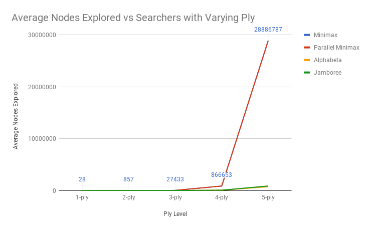
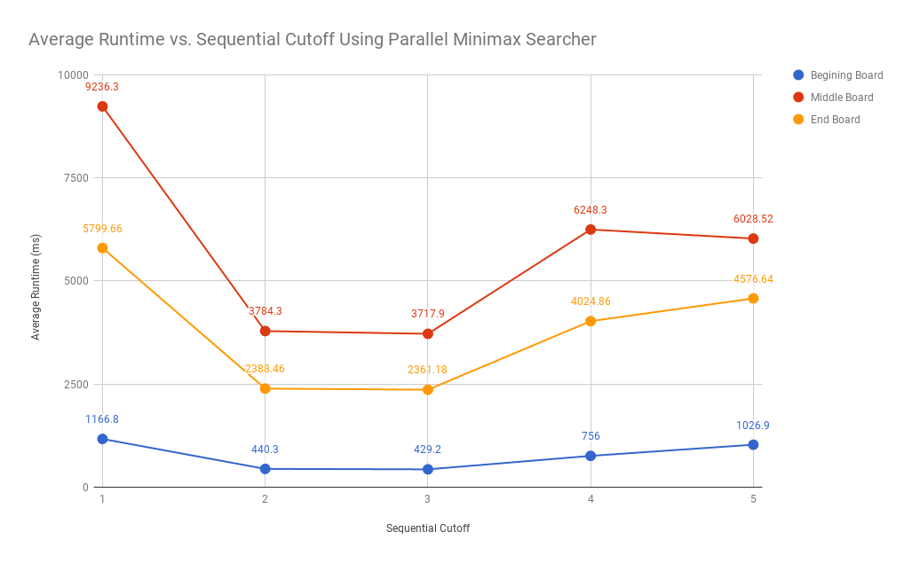
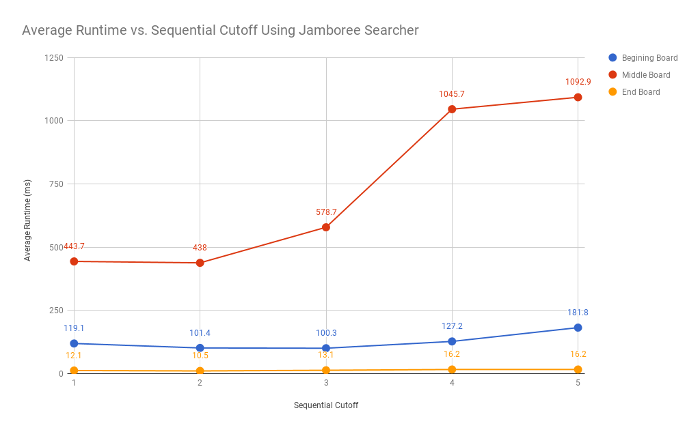
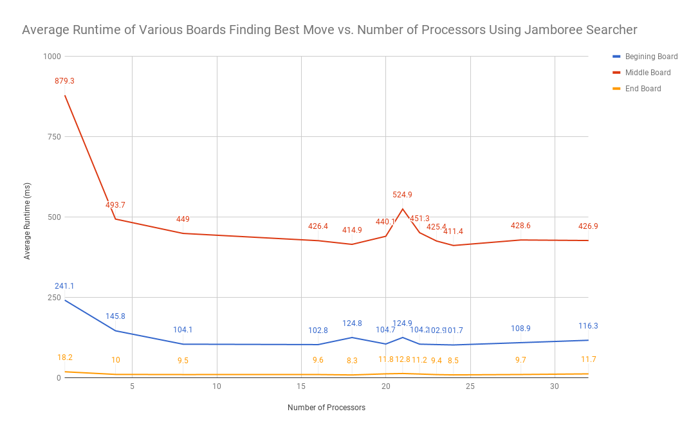
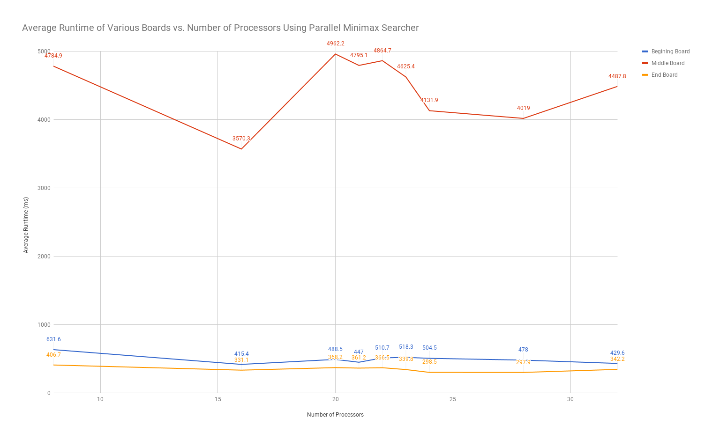
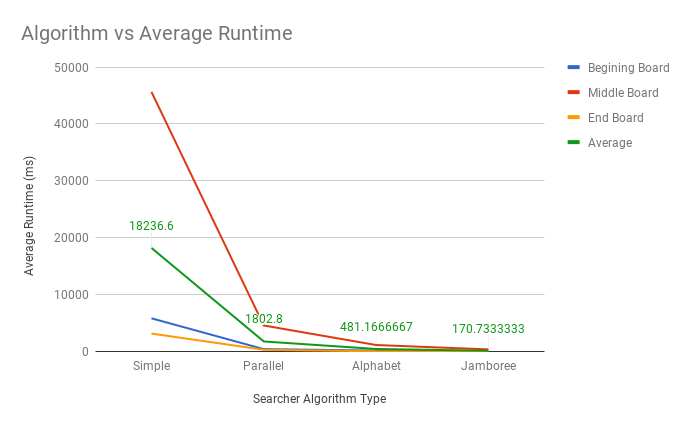

# Project 3 (Chess) Write-Up #
--------

## Project Enjoyment ##
- How Was Your Partnership?
  <pre> It was very good. We work well together, and it's helpful to be able 
  to bounce ideas off on another. We have similar schedules so we have time 
  to work together  </pre>
  
- What was your favorite part of the project?
  <pre> PLaying on the server after finishing our bots,
  and seeing how we could make it faster/better </pre>

- What was your least favorite part of the project?
  <pre> Figuring out how to run experiments. </pre>

- How could the project be improved?
  <pre> The project clarity and enjoyment was fun
  for the most part! </pre>

- Did you enjoy the project?
  <pre> Yeah! </pre>
    
-----

## The Chess Server ##
- When you faced Clamps, what did the code you used do?  Was it just your jamboree?  Did you do something fancier?
  <pre>
  We only used our jamboree.
  </pre>

- Did you enjoy watching your bot play on the server?  Is your bot better at chess than you are?
  <pre>
  
  We really enjoyed watching the bot and would get very anxious if it seemed like
  our bot was about to lose. Our bot is definitely much better than chess than we 
  are cause we don't know how to play chess.
  
  </pre>

- Did your bot compete with anyone else in the class?  Did you win?
  <pre> We competed our bot against team JudgmentDay, and won once out of 3 times.</pre>

- Did you do any Above and Beyond?  Describe exactly what you implemented.
  <pre> We did not do the above and beyond. </pre>

## Experiments ##

### Chess Game ###

#### Hypotheses ####
Suppose your bot goes 3-ply deep.  How many game tree nodes do you think
it explores (we're looking for an order of magnitude) if:
 - ...you're using minimax?
    <pre>
    The branching factor of a tree is the number of children a node has and 
    the average branching factor in chess is 35. Minimax explores every node 
    in the tree therefore minimax would explore about 35^h, with h being the
    ply level. For example, if ply were 2, then the average number of nodes to
    be explored would be 35^2, which is about 1225. So it follows that the
    average number of nodes for ply of 1,2,3,4,5 would be 35,1225,42875,1500625,
    and 52521875 respectively. We expect these numbers to be large because
    minimax explores all the nodes at the given depths.
    </pre>
 - ...you're using alphabeta? 
    <pre>
    Since we are pruning in alpha beta, we expect there to be less nodes
    explored in alphabeta. In relation to our percentage cutoff, we estimate this
    to be 40% of the nodes less than what we had explored in minimax, since alphabeta
    will not be exploring all nodes of the certain depth. We reason that this may be 
    40% less because, with pruning, an entirety of a branch could be cut off from being
    considered by the searcher. This is a substantially large amount of branches being
    cut off. This being said, it is not to say that most of the nodes will not be explored,
    since, in order for the comparisons of alpha beta to work, a certain number of nodes
    sill needs to be explored. So, we hypothesize the number of nodes to be explored
    in alphabeta of ply 1,2,3,4,5 to be 21,735,25725,900375,31513125 respectively.
    </pre>

#### Results ####
Run an experiment to determine the actual answers for the above.  To run
the experiment, do the following:
1. Run SimpleSearcher against AlphaBetaSearcher and capture the board
   states (fens) during the game.  To do this, you'll want to use code
   similar to the code in the testing folder.
2. Now that you have a list of fens, you can run each bot on each of them
   sequentially.  You'll want to slightly edit your algorithm to record the
   number of nodes you visit along the way.
3. Run the same experiment for 1, 2, 3, 4, and 5 ply. And with all four
   implementations (use ply/2 for the cut-off for the parallel
   implementations).  Make a pretty graph of your results (link to it from
   here) and fill in the table here as well:

<pre>

</pre>


|      Algorithm     | 1-ply | 2-ply | 3-ply | 4-ply | 5-ply  |
| :----------------: |:-----:|:-----:|:-----:|:-----:|:------:|
|       Minimax      |28     |857    |27433  |866653 |28886787|
|  Parallel Minimax  |28     |857    |27433  |866653 |28886787|
|      Alphabeta     |27     |358    |6203   |64523  |737831  |
|      Jamboree      |28     |381    |6907   |71130  |872314  |

#### Conclusions ####
How close were your estimates to the actual values?  Did you find any
entry in the table surprising?  Based ONLY on this table, do you feel
like there is a substantial difference between the four algorithms?
<pre>
To collect this data we used about 50 fens, varying across the different states
of the game to test the averages across the board. We did this because the states
of the board in various stages of the game could be affect how many moves there
are to consider, and the best move for that state. A new node was considered
"explored" when the board applied a move. The averages of each of these boards
were taken on individual plys. The graph depicts the same data as the table, but
serves to give a visual on the great differences (or lack of) between the different
searchers. TestNodesExplored.java contains the testing code for this experiment, 
along with the other EXP__.java files, being the experimental changes to our
searchers.

Our estimates in relation to minimax were fairly accurate, but were smaller
than the actual recorded data. Our estimates in relation to alphabeta were also
smaller than the recorded data, with the exception being ply 1, whose guess was
smaller than the actual data. Even so, our estimates were fairly close to what was
recorded, and the hypothesis that alphabeta exploring less nodes was true.

Looking at only the table, we believe that minimax and parallel minimax do not
have a substantial difference in their algorithms. Even though one runs faster
than the other, the data shows that minimax and its parallel counterpart both
explore the same number of nodes when finding the best move. This implies that,
by only looking at the table, the algorithms behind minimax and parallel minimax
do not have a substantial difference.

On the other hand, when you compare minimax(and parallel version) with alphabeta,
there a much more noticeable difference between how many nodes each explores,
with the exception of 1-ply, having the same number of nodes. We can see that when
comparing the nodes of minimax with alphabeta, the alphabeta algorithm explores about
58.226% less nodes at 2-ply, 77.389% less at 3-ply, 92.555% less at 4-ply, and 97.446%
less at 5-ply. Here we can see that at larger ply values, the difference between minimax and
alphabeta nodes explored increases significantly, but at a slower rate as the ply
increase. From here, it is clear that using an algorithm from alphabeta maybe advantageous,
for it explores an incredibly smaller amount of nodes at larger plys.

Jamboree had a smaller number of nodes explored (again, with the exception of ply-1,
with 28 nodes explored, the same as most other searchers). It was expected to see that the
jamboree showed a larger value of nodes explored when just looking at the table, as compared
to alphabeta. The difference is not substantially great, but shows that there is some difference
in their algorithms. This is most likely due to the fact that jamboree has to sequentially run
the alpha beta like algorithm on a certain percent of moves, before using parallelism on the rest
, not passing in bounds to the entirety of the rest of the moves. This means that the bounds
checking, like in alpha beta, is not global to the entirety of the problem in jamboree.
</pre>

### Optimizing Experiments ###
THE EXPERIMENTS IN THIS SECTION WILL TAKE A LONG TIME TO RUN. 
To make this better, you should use Google Compute Engine:
* Run multiple experiments at the same time, but **NOT ON THE SAME MACHINE**.
* Google Compute Engine lets you spin up as many instances as you want.

#### Generating A Sample Of Games ####
Because chess games are very different at the beginning, middle,
and end, you should choose the starting board, a board around the middle
of a game, and a board about 5 moves from the end of the game.  The exact boards
you choose don't matter (although, you shouldn't choose a board already in
checkmate), but they should be different.

### Sequential Cut-Offs ####
Experimentally determine the best sequential cut-off for both of your
parallel searchers.  You should test this at depth 5.  If you want it
to go more quickly, now is a good time to figure out Google Compute
Engine. Plot your results and discuss which cut-offs work the best on each of
your three boards.

<pre>
TestSequentialCutoff.java in the experiment package contains the test code
to determine the best sequential cut-off for a parallel minimax searcher and 
jamboree searcher. These test ran on GCE using 32 cores. The sequential cut-off 
denotes when our code stops parallelforking and executes sequentially. We created 
a sample of games to run this test on, sampled from a list of fens generated by 
running SimpleSearcher against AlphaBetaSearcher and capturing the board states. 
SimpleSearch was set to depth 3 and cutoff 3 and AlphaBetaSearcher was set to depth 
4 and cutoff 4. Our"beginning board" is the first board in the list, our "middle board" 
is some board in the middle of the list, and our "ending board" is 8 boards from the 
last board in the list. To determine the best sequential cut-off for parallel minimax, we 
create a new parallel minimax searcher and jamboree search and for 15 times, found 
the best move of the beginning board at depth 5 and cut-off 1. The runtime for 
the last 10 tests and the average runtime of these 10 tests were printed into 
console. We discard the first 5 tests so java could warm up to the algorithm. 
10 runtimes and its average were also found for depth 5 and cut-offs 2, 3, 4, 
and 5 for each searcher. This process was repeated to find the best move of the 
middle and ending board for both searchers. The average runtime for each board at 
varying cut-offs is graphed in Graph1.ParallelSequentialCutoff.png and 
Graph2.JamboreeSequentialCutoff.png.





As seen in Graph1, the average runtime is smallest at cut-off 3 for all three boards 
using parallel minimax searcher, although the runtimes at a cut-off of 2 is very close 
to the runtimes at a cut-off of 3. The runtime increases significantly for a cut-off of 
1 because there would be a large amount of threads waiting for the "left" to execute 
before being able to join with the "right". The run time for a cut-off of 4 and 5 also
increases because the searcher does more work sequentially. It is confusing why the 
runtime for cut-off 5 isn't the longest because at a cut-off of 5, the code isn't running 
in parallel, but all in sequentially using minimax. Furthermore, from our previous experiment, 
at ply 5 minimax needs to visiit upwards from 20000000 nodes. A cut-off of 3 for parallel
minimax is reasonable because it would allocate a balanced amount of work to be done 
sequentially and in parallel. As seen in Graph2, the average runtime is smallest at cut-off 
2 for all three boards using jamboree searcher although we expected the cutoff for jamboree 
to be the best at 3. This is because alpha-beta should be able to run more optimally at a 
higher cutoff than minimax. Alpha-beta prunes branches that are not within its alpha beta 
range therefore even with a larger cut-off, alpha-beta will prune branches and visit less 
nodes than minimax would need to. From our first experiment, at ply 3 alpha-beta visited 
almost 3/4 less nodes than minimax did. 
</pre>

#### Number Of Processors ####
Now that you have found an optimal cut-off, you should find the optimal
number of processors. You MUST use Google Compute Engine for this
experiment. For the same three boards that you used in the previous 
experiment, at the same depth 5, using your optimal cut-offs, test your
algorithm on a varying number of processors.  You shouldn't need to test all 32
options; instead, do a binary search to find the best number. You can tell the 
ForkJoin framework to only use k processors by giving an argument when
constructing the pool, e.g.,
```java
ForkJoinPool POOL = new ForkJoinPool(k);
```
Plot your results and discuss which number of processors works the best on each
of the three boards.
<pre>TODO: Do the experiment; discuss the results (possibly with pretty graphs!)

TestJamboreeProcessor.java in the experiment package contains the test code to 
determine the most optimal number of processors to use while running jamboree 
searcher. The number of processors determines how many threads will running 
concurrently in parallel code. We create a sample of games to run this test on, 
sampled form a list of fens generated by running SimpleSearcher against 
AlphaBetaSearcher and capturing the board states. SimpleSearch was set to depth 3 
and cutoff 3 and AlphaBetaSearcher was set to depth 4 and cutoff 4. Our "beginning 
board" is the first board in the list, our "middle board" is board 20 of the list, 
and our "ending board" is board 55 of the list. To determine the most optimal number 
of processors, we create a new jamboree searcher whose ForkJoinPool variable is 
passed in a parameter which denotes how many processors to use and for 15 times,
found the best move of the beginning board at depth 5 and cutoff 2. This cutoff was 
previously determined as the best cut-off for a jamboree searcher. The runtime for 
the last 10 tests and the average runtime of these 10 tests were printed into console. 
We discard the first 5 tests so java could warm up to the algorithm. This process was 
repeated for the middle and ending board as well. We decided not to run a test for 
every possible number of processor (1 -32), instead, we intuitively thought that more 
processors would result in shorter average runtimes therefore we first tested using 16, 
24, and 32 processors. We found the following: (in order of longest runtime to fastest 
runtime) 32, 16, 24. We then tested 18 and 20 processors but both resulted in average 
runtimes longer than those when using 16 processors. From this, we assumed using 17 and 
19 processors would not improve runtime either.We then test 21, 22, and 23 processors 
and find that the average runtime is the shortest for all three boards when using 24 
processors. We also test 8 processors and as expected, the average runtimes are
longer than those when using 16 processors. The results from running all these tests 
are summarized in Graph1.JamboreeProcessors.png. 



This process was repeated to test the most optimal number of processors to use when 
running parallel minimax searcher. The only difference is that the best cut-off we 
determined for parallel minimax is 3. When choosing the amount of processors to test, 
a similar procedure and thought-process to the one above was used. The results differed
a little, and using 24 processors resulted in the shortest average runtimes. The results 
for parallel minimax searcher are summarized in Graph2.ParallelProcessors.png. 



When only using a few processors, the runtimes increase significantly and the rate of decrease 
in runtime decreases with each additional processor. Due to forking and joining when running 
in parallel, increasing the number of threads running also introduces a wait time since that 
"left" must execute completely before being able to join with the "right". Although intuitively 
we expect using 32 processors would optimize runtime, the runtimes for using 24 and 32 processors 
are extremely close. This implies that the boards do not have more than 24 threads to run therefore 
when we run with 32 processors, we are not actually using 32 processors, but instead there are 
unused processors. The runtime for the start board and end board are much lower than the runtime 
for the middle board most likely because middle boards have more possible moves. A start board 
can only move two types of chess pieces, pawns or knights, and an end board has only a few pieces 
left on the board therefore the number of moves for each ending board is lower. Especially when 
running parallel minimax on the middle board, the lack of pruning means the algorithm must visit 
every node. 
</pre>

#### Comparing The Algorithms ####
Now that you have found an optimal cut-off and an optimal number of processors, 
you should compare the actual run times of your four implementations. You MUST
use Google Compute Engine for this experiment (Remember: when calculating
runtimes using *timing*, the machine matters).  At depth 5, using your optimal 
cut-offs and the optimal number of processors, time all four of your algorithms
for each of the three boards.

Plot your results and discuss anything surprising about your results here.
<pre>
In this experiment, we used our optimal cut-off of 2 for Jamboree/alphabeta and 3
for parallel/minimax. The optimal number of processors used for parallel minimax and
minimax was 24, while the number of processors for jamboree/alphabeta was 24. Divide cutoff
was kept at 8 for the parallel algorithms, and percentage sequential was kept at 50% for jamboree.
Depth 5 was kept consistent with all tests.
Our testing code can be found in TestAlgorithm.java, where we tested 3 different boards
of varying states, and their associated runtimes when finding the best move at those
states. The first 5 tests were thrown out to consider warm-up, and the averages of
ten tests were taken and recorded on the table below. This graph gives a visual
representation of the algorithm vs each board's average runtime.



The data values plotted on the graph for the average of the board gives aid to the
estimates of what values lie on the board, but the more accurate data comes from
the table. From this graph, we can see that on average, Minimax had the greatest
runtime, followed by parallel minimax, alphabeta, then jamboree. In general, the
difference in time stayed fairly consistent throughout the boards.

Comparing jamboree to minimax, jamboree was 98.31% faster in early game, 99.11% faster mid
game, and 99.73% faster late game. This was to be expected with minimax and jamboree
because jamboree's algorithm uses bounds checking, which stops it from checking more
nodes than it needs to (which takes up time). Minimax on the other hand, checks ALL
nodes, which in turn would take a substantial amount of time. Minimax also does not
use parallelism (something jamboree uses), so it would take more time in that regards.

Comparing the parallel minimax and minimax, parallel is 92.22% faster early game,
89.90% mid game, and 89.26% late game. Parallel is substantially faster than normal
minimax. This is not surprising because parallel uses parallelism, getting multiple threads
to work on smaller parts of the problem at the same time, which would be expected to
reduce the time needed.

Comparing alphabeta to jamboree, jamboree is 50.18% faster early game, 65.62% mid game,
and 87.25% late game. This goes to show that there is a greater difference in time
depending on the game state, which shows that the game state does mater. Otherwise,
jamboree still shows to be faster than alphabeta by a good amount. This amount is not
nearly as parallelminimax vs minimax. This might be because parallel minimax and minimax
have very similar alogrithms, while jamboree and alphabeta had mostly the same algorithm 
but not exactly. To further explain this, it would be good to reference how alphabeta is
not naturally parallelizable while minimax is. So, in the parallel implementation of alphabeta,
we had to make some changes to how the algorithm would be processed in a parallel way.
This meant having to calculate a certain percent of moves sequentially, then moving onto
a parallel structure for the rest of the moves. So in turn, only a percentage is truly taking
advantage of parallelism, which is an acceptable loss, since we still get the overall benefit.
So, jamboree would be at a closer time to alphabeta, than parallel minimax is to minimax.

The other data is of expected value, with the reasoning discussed in previous sections. Minimax
is slower than alphabeta because it must go through all nodes, while alphabeta does not. Parallel
minimax is slower than alphabeta for that same reason, though alphabeta is about 70.40% faster on
average, for parallel minimax takes advantage of parallelism, so their difference is slightly smaller.

The data was not particularly surprising, and this general data, with the ordering of fastest
to slowest algorithm was expected.
</pre>	
				
|      Algorithm     | Early Game | Mid Game | End Game |
| :----------------: |:----------:|:--------:|:--------:|
|       Minimax      | 5868.9     | 45652.7  | 3188.2   |
|  Parallel Minimax  | 456.3      | 4609.8   | 342.3    |
|      Alphabeta     | 198.7      | 1177.3   | 67.5     |
|      Jamboree      | 99         | 404.8    | 8.6      |				

### Beating Traffic ###
In the last part of the project, you made a very small modification to your bot
to solve a new problem.  We'd like you to think a bit more about the 
formalization of the traffic problem as a graph in this question.  
- To use Minimax to solve this problem, we had to represent it as a game. In
  particular, the "states" of the game were "stretches of road" and the valid
  moves were choices of other adjacent "stretches of road".  The traffic and
  distance were factored in using the evaluation function.  If you wanted to use
  Dijkstra's Algorithm to solve this problem instead of Minimax, how would you
  formulate it as a graph?
  <pre> The starting vertex would be your root board, the board you start at before 
  applying any moves. There would exist another node which would be the target
  destination. Each edge would be a road, where the cost of each edge is dependent
  on the traffic and speed limit of the road. The other nodes are the areas where
  there are adjacent roads to the one you just took. You could then use Dijkstra's
  to determine the best route to your destination.</pre>

- These two algorithms DO NOT optimize for the same thing.  (If they did,
  Dijkstra's is always faster; so, there would be no reason to ever use
  Minimax.)  Describe the difference in what each of the algorithms is
  optimizing for.  When will they output different paths?
  <pre> Dijkstra's algorithm optimizes the smallest cost of the path to the destination.
  On the other hand, minimax optimizes just against what "nature" would be playing against them, so
  the factors of traffic and speed limits, meaning it minimizes the number of seconds
  in traffic during the trip, trying to choose the shortest path. It will consider both the cost
  and the path when choosing a road.
  The case where they would give different paths would be when the cost from getting from
  one spot to another has the same cost of traffic and speed limit, but one is the shorter
  path. Since Dijkstra's algorithm does not consider the number of roads taken, it is possible
  that it will choose a path with more roads. But minimax takes account for time as a whole,
  so, it would pick the path with the shorter amount of roads needed to be taken.</pre>